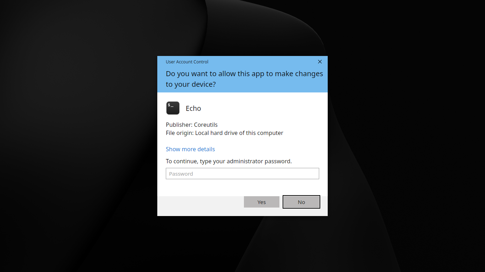
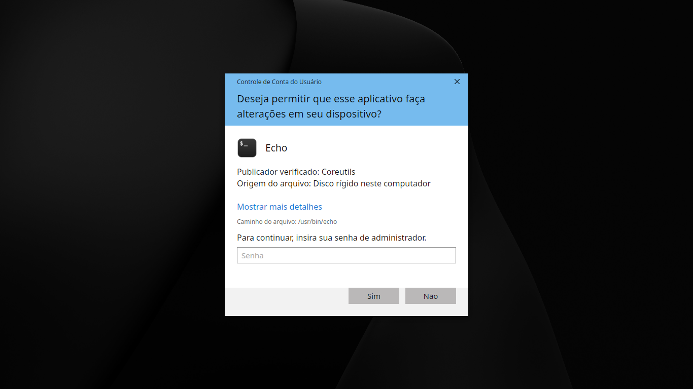

# UAC
OpenWin's User Account Control Module.

Use `./install.sh` to install and `./uninstall.sh` to uninstall.

##### Tested Platforms
| OS | Works? |
| :--- | ---: |
| Linux Mint | Yes |
| Kubuntu | Yes |

### Screenshots

